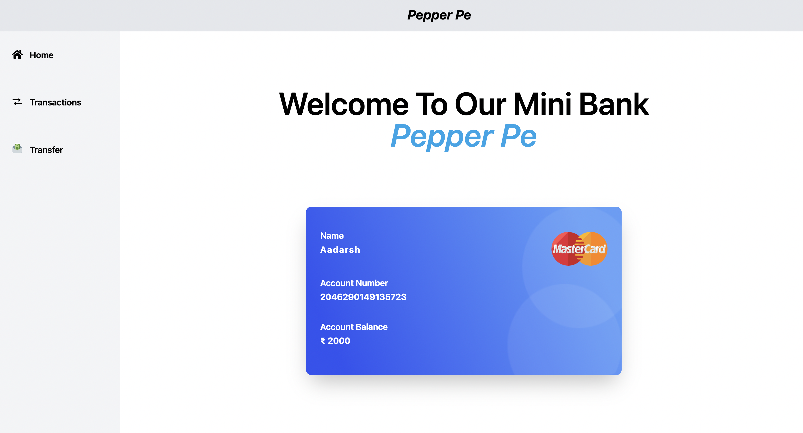
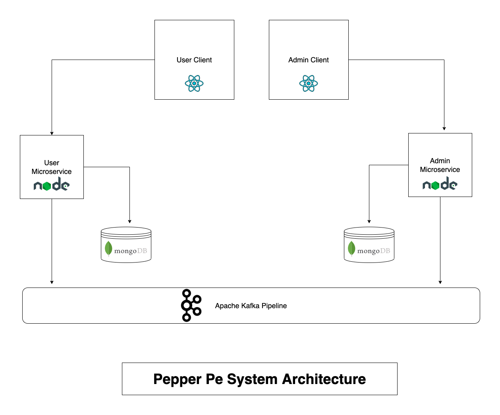
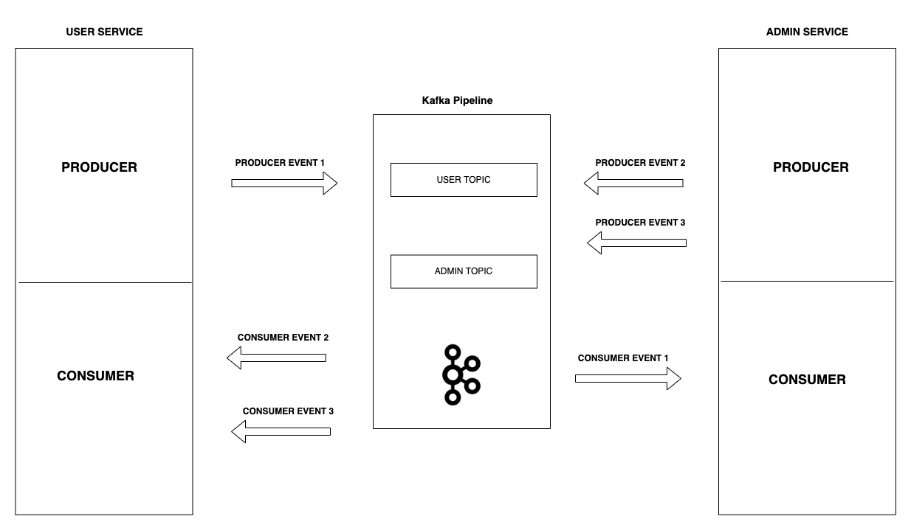

# Pepper Pe - Mini Bank

This project was built with the following stack:

| BACKEND         | FRONTEND     |
| --------------- | ------------ |
| Typescript      | Javascript   |
| NodeJS          | ReactJS      |
| ExpressJS       | Tailwind CSS |
| MongoDB         | React Router |
| Apache Kafka    | Vercel       |
| Confluent Cloud |              |
| Heroku          |              |

My main focus while developing this project was to maintain a complete **microservice architecture** with as fewer bottleneck scenarios as possible. So I went with the following system architecture

I not only made independent services on the backend but also on the frontend this approach is called **micro-frontend architecture** where an independent frontend is developed and deployed separately.

**Apache Kafka Pipeline Event:**

PRODUCER EVENT 1:

- Once a transaction is completed between users in the user service this event is emitted with transaction details as the payload and then the admin service consumes this event via **admin-topic** and updates the user entity in admin DB.

PRODUCER EVENT 2:

- Once the admin creates a user in the admin service this event is emitted with user details as the payload and then the user service consumes this event via **user-topic** and updates the user entity in user DB.

PRODUCER EVENT 3:

- Once the user makes a deposit / withdraws the admin service emits an event with the transaction details as payload and then the user service consumes that event via **user-topic** and updates the user balance and logs the transaction.

**Mongo DB Tables:**

- User Database tables:

- Admin Database tables:

---

**Developed by: [Aadarsh S](http://itsaadarsh.com/)**
